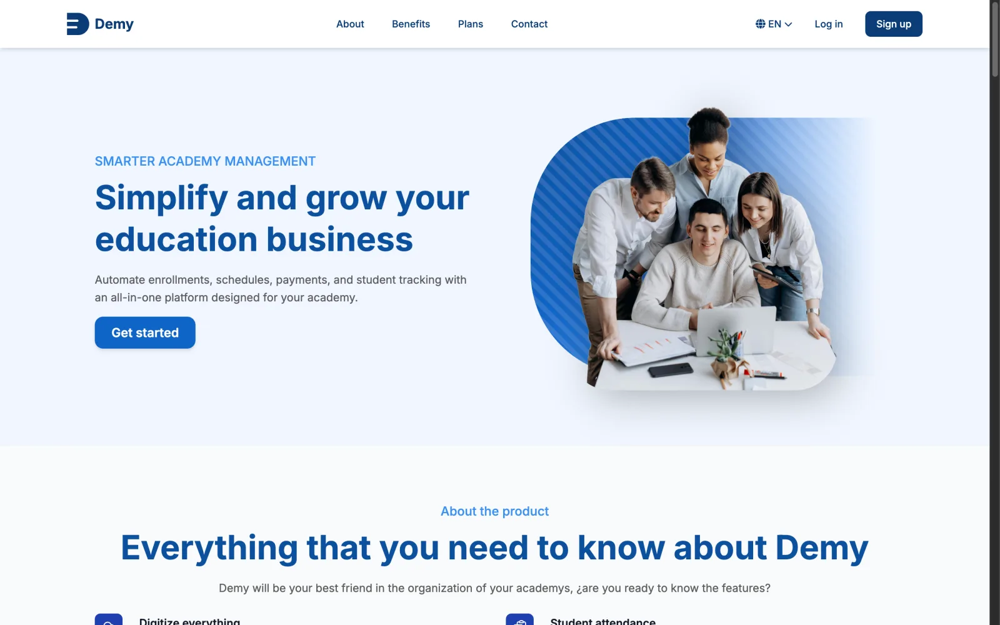
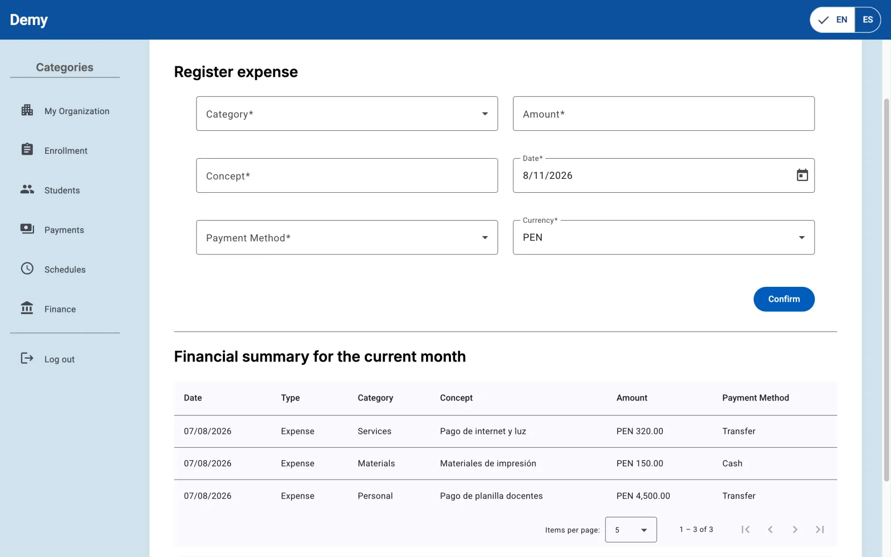
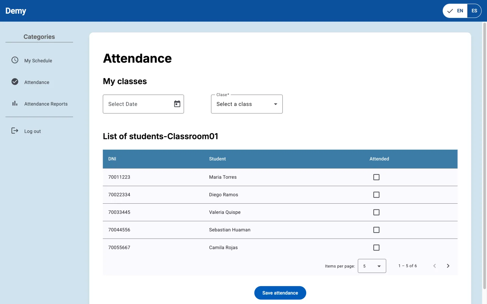
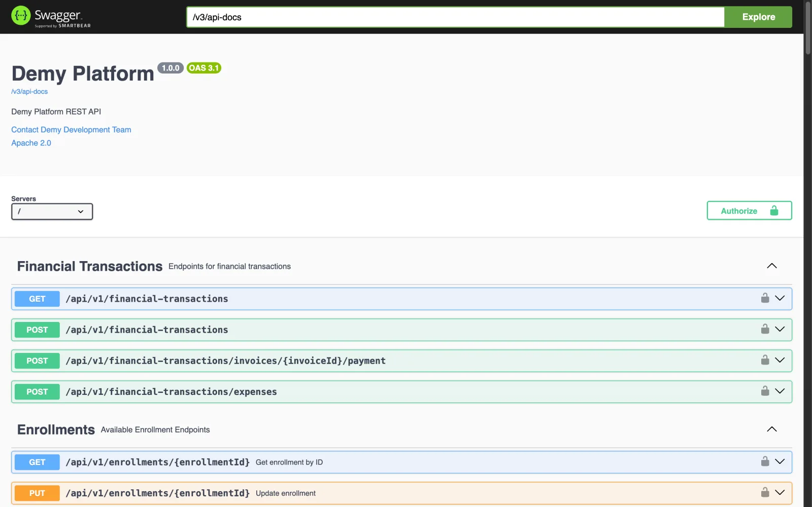

<div align="center">


### Technology for more efficient, transparent, and accessible academy management

</div>

---

## About SmartEdu

**SmartEdu** is a startup founded by Software Engineering students to improve how educational academies in Peru manage their daily operations. It focuses on replacing fragmented, manual processes with accessible technology designed around the real workflows of in-person education providers.

Our mission is to transform academy administration by streamlining essential processes such as enrollment, attendance, scheduling, and payments. Our vision is to help lead the digital transformation of educational academies in Peru through solutions that make internal operations more efficient, transparent, and accessible.

## Meet Demy

<div align="center">


### SmartEdu's all-in-one platform for academic and administrative management

<p><strong>Explore Demy</strong></p>

<table align="center">
<tr>
<td align="center"><a href="https://demy-academy.netlify.app/" title="Visit Demy landing page"></a></td>
<td align="center"><a href="https://demy-web-app.netlify.app/demo" title="Try Demy live demo"></a></td>
</tr>
</table>

</div>

---

**Demy** is the web platform through which SmartEdu delivers that mission. It simplifies academic and administrative management for pre-university academies, institutes, and tutoring centers, replacing scattered spreadsheets and messages with a single workspace for enrollment, scheduling, attendance, payments, finances, and user administration.

The product provides dedicated experiences for two roles:

- **Administrators** manage students, teachers, courses, classrooms, academic periods, enrollments, schedules, billing, and expenses.
- **Teachers** review or reschedule their classes, record attendance, and inspect attendance reports.

The interface is available in English and Spanish and adapts to desktop and mobile browsers.

## Repositories

| Repository | Description | Stack |
|---|---|---|
| [**demy-web-app**](https://github.com/smarteduhq/demy-web-app) | Responsive SPA for administrators and teachers, with authentication, role-aware navigation, and internationalization. | [](https://angular.dev) [](https://www.typescriptlang.org/) |
| [**demy-web-service**](https://github.com/smarteduhq/demy-web-service) | JWT-secured REST API covering IAM, Enrollment, Scheduling, Attendance, and Billing. | [](https://spring.io/projects/spring-boot) [](https://openjdk.org/) [](https://www.mysql.com/) |
| [**demy-landing-page**](https://github.com/smarteduhq/demy-landing-page) | Responsive public product website in English and Spanish. | [](https://developer.mozilla.org/en-US/docs/Web/HTML) [](https://tailwindcss.com/) [](https://developer.mozilla.org/en-US/docs/Web/JavaScript) |
| [**demy-report**](https://github.com/smarteduhq/demy-report) | Academic report covering research, requirements, design, architecture, and sprint evidence. | [](https://www.markdownguide.org/) [](https://plantuml.com/) |

## Preview

<div align="center">

<table>
<tr>
<td width="50%"><br/><sub>Public product website</sub></td>
<td width="50%"><br/><sub>Financial management</sub></td>
</tr>
<tr>
<td width="50%"><br/><sub>Attendance registration</sub></td>
<td width="50%"><br/><sub>OpenAPI-documented REST API</sub></td>
</tr>
</table>

</div>

## Architecture

```text
demy-landing-page ───────▶ registration and sign-in
                                  │
                                  ▼
demy-web-app ───── HTTP/REST + JWT ─────▶ demy-web-service ───── JPA ─────▶ MySQL
  Angular 19                               Spring Boot 3.5
```

The frontend and backend share a functional organization around the **IAM**, **Enrollment**, **Scheduling**, **Attendance**, and **Billing** bounded contexts. Within the service, each context separates domain, application, infrastructure, and REST interface concerns.

## Project background

SmartEdu and Demy began in the **1ASI0729 - Open Source Application Development** course of the Software Engineering program at the **Peruvian University of Applied Sciences (UPC)**. The team applied Lean UX, Domain-Driven Design, GitFlow, and continuous documentation to take the product from research to an integrated web release.

---

<div align="center">

Read the [project report](https://github.com/smarteduhq/demy-report) for the complete process and supporting evidence.

</div>
