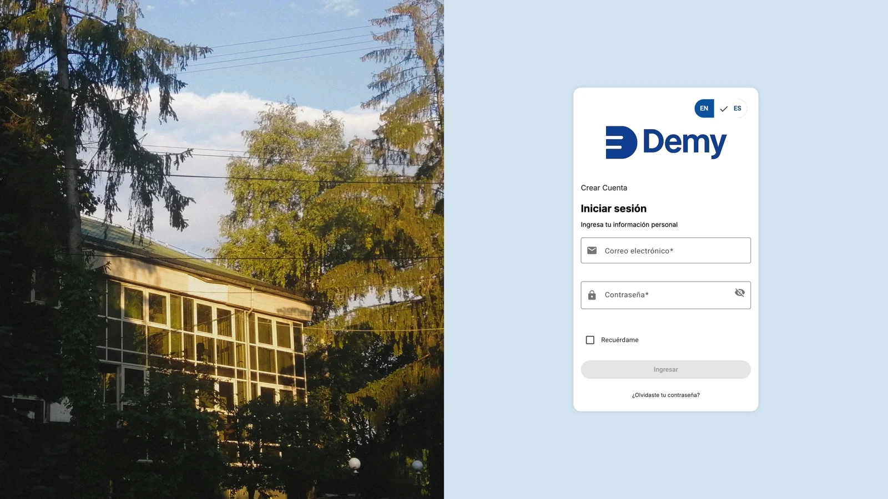
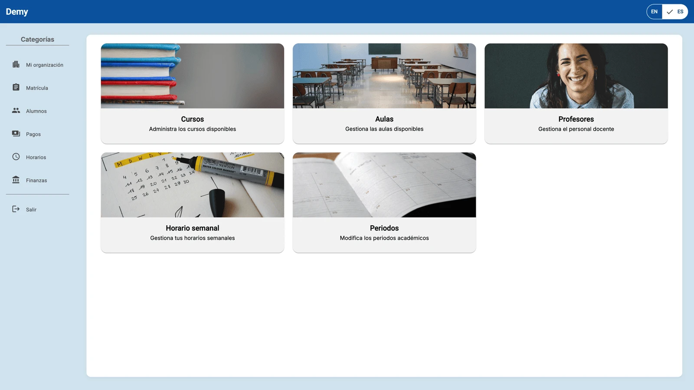
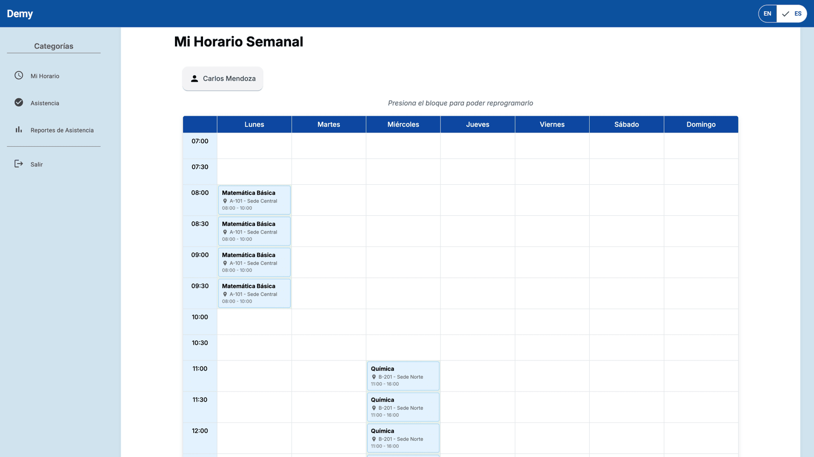

<div align="center">


### Plataforma académica todo-en-uno para academias de educación tradicional

[](https://angular.dev)
[](https://spring.io/projects/spring-boot)
[](https://openjdk.org/)
[](https://www.typescriptlang.org/)
[](https://www.mysql.com/)
[](https://opensource.org/licenses/MIT)

</div>

---

## ¿Qué es Demy?

**Demy** es una plataforma web pensada para simplificar la gestión académica y administrativa de academias de educación tradicional (preuniversitarias, institutos, academias de reforzamiento, etc.). Centraliza en un solo lugar procesos que hoy suelen resolverse con hojas de cálculo y mensajes sueltos: matrículas, horarios, asistencia, pagos y administración de usuarios.

El proyecto nació como parte del curso **1ASI0729 - Desarrollo de Aplicaciones Open Source** de la carrera de Ingeniería de Software de la **Universidad Peruana de Ciencias Aplicadas (UPC)**, bajo la startup ficticia **SmartEdu**, y fue construido siguiendo **Lean UX** y **Domain-Driven Design (DDD)**, con una separación clara en bounded contexts: IAM, Enrollments, Scheduling, Attendance y Billing.

## Vista previa

<div align="center">

<table>
<tr>
<td width="33%"><br/><sub>Inicio de sesión</sub></td>
<td width="33%"><br/><sub>Panel del administrador</sub></td>
<td width="33%"><br/><sub>Horario semanal del profesor</sub></td>
</tr>
</table>

</div>

## Repositorios

| Repositorio | Descripción | Stack |
|---|---|---|
| [**demy-web-app**](https://github.com/smarteduhq/demy-web-app) | Aplicación web (SPA) para coordinadores, profesores y estudiantes. Componentes standalone, ruteo lazy-loaded por bounded context, i18n e internacionalización accesible. | Angular 19 · Angular Material · ngx-translate |
| [**demy-web-service**](https://github.com/smarteduhq/demy-web-service) | API REST que expone los distintos bounded contexts del dominio (IAM, Enrollments, Scheduling, Attendance, Billing) siguiendo una arquitectura por capas. | Spring Boot 3.5 · Java 21 · MySQL · JPA |
| [**demy-landing-page**](https://github.com/smarteduhq/demy-landing-page) | Landing page de presentación del producto, con soporte multi-idioma (inglés/español). | HTML · Tailwind CSS · JavaScript |
| [**demy-report**](https://github.com/smarteduhq/demy-report) | Informe académico del proyecto: contexto, elicitación de requerimientos, diseño y evidencias de desarrollo por sprint. | Markdown |

## Arquitectura

Demy está organizada como un sistema de dos capas (frontend SPA + backend API REST) desacoplado por bounded contexts de dominio:

```
demy-web-app  ──HTTP/REST──▶  demy-web-service  ──JPA──▶  MySQL
(Angular 19)                  (Spring Boot 3.5)
```

Cada bounded context (**IAM**, **Enrollments**, **Scheduling**, **Attendance**, **Billing**) se modela de forma independiente tanto en el frontend como en el backend, siguiendo los principios de Domain-Driven Design.

## Equipo

Demy es desarrollado por un equipo de estudiantes de Ingeniería de Software de la UPC, como parte de su formación en desarrollo de software open source.

---

<div align="center">

¿Quieres saber más? Revisa el [informe del proyecto](https://github.com/smarteduhq/demy-report).

</div>
